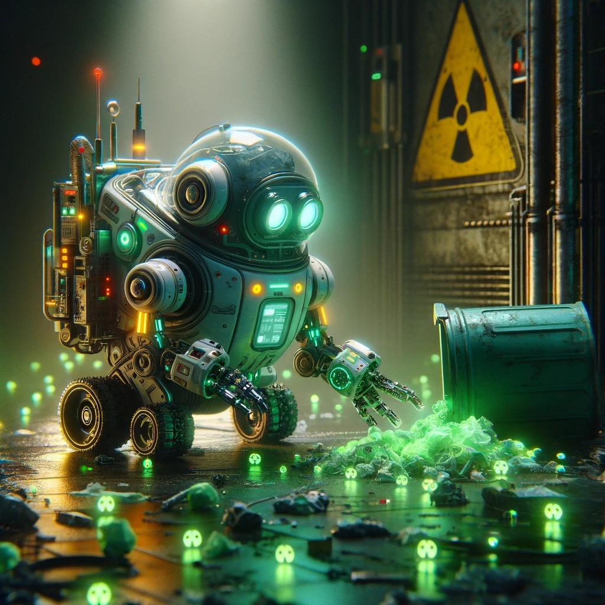
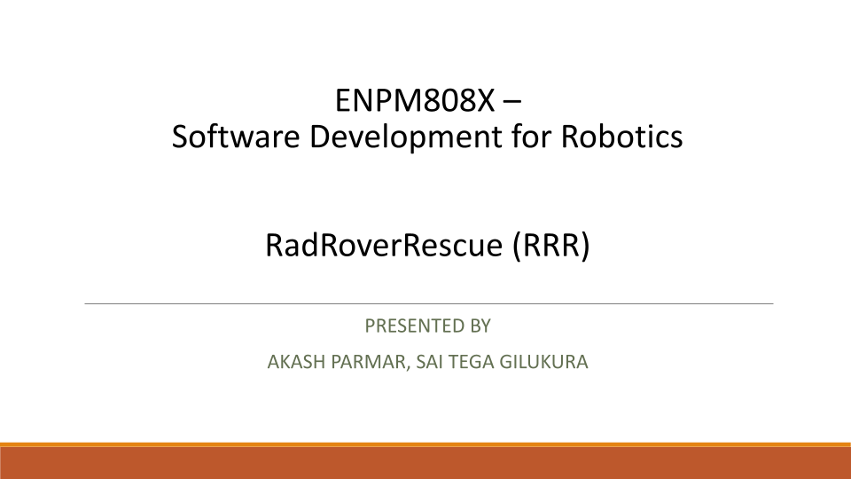
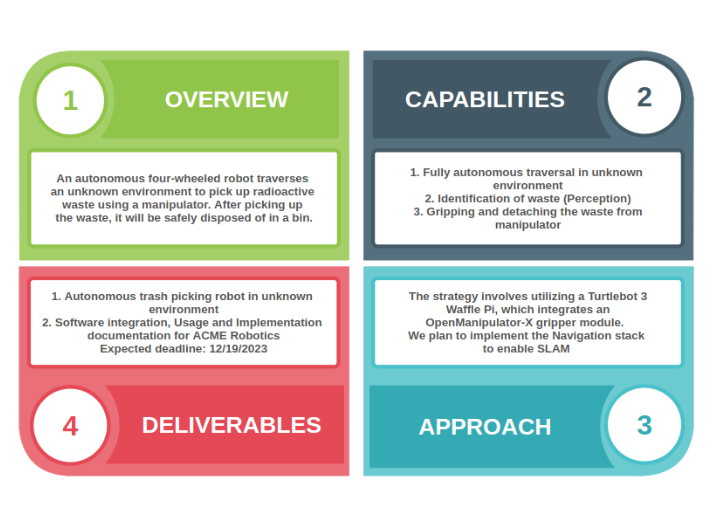

# Acme Robotics: RadioactiveRoverRescue - A Robot to Pick Up Radioactive Waste

## ENPM 808X Final Project

[](https://codecov.io/gh/saiteja12-g/RadRoverRescue)
[](LICENSE)

# Student Details

|Name|Akash Parmar|Sai Teja Gilukara|
|---|:---:|:---:|
|UID|118737430|119369623|
|Directory ID|akasparm|saitejag|
|Email ID|akasparm@umd.edu|saitejag@umd.edu|

# Introduction

The project represents a pioneering venture in the realm of radioactive waste management, leveraging cutting-edge robotic technology to address a critical challenge in modern industry and healthcare. Radioactive waste, a byproduct of nuclear power generation, medical procedures, and various industrial activities, presents a significant environmental and health hazard. Conventional waste management techniques, often reliant on human intervention, expose workers to harmful radiation, posing severe health risks and potential contamination issues. This initiative aims to revolutionize the way we approach this pressing problem by introducing an advanced robotic system capable of operating autonomously in high-risk environments.

The robot at the heart of this project is meticulously engineered to navigate hazardous areas typically found in nuclear power plants, medical facilities, and industrial sites where radioactive materials are prevalent. It is equipped with state-of-the-art sensors and employs sophisticated computer vision algorithms to accurately identify and locate radioactive waste. This capability is crucial in ensuring the safe handling of hazardous materials.

Beyond mere detection, the robot is adept at performing a range of precise tasks. It can securely collect and contain radioactive waste, thereby minimizing the risk of spillage or accidental exposure. Once the waste is safely secured, the robot is programmed to transport it to designated disposal areas, ensuring that the waste is managed in a way that adheres to safety standards and regulatory requirements. This automated process drastically reduces the need for human involvement in direct waste handling, significantly mitigating the risk to personnel and contributing to a safer workplace environment.

<p align="center">

</p>

<!--  -->
# Presentation
<p align="center">

</p>

Link [here](https://docs.google.com/presentation/d/1TiUnq8p5OIJHzkEwPwo8l9pRjR80l-Jc94Y3MlGZMxk/edit?usp=sharing)

# Agile-Iterative Process (AIP) Resources
## Quad Chart
<p align="center">

</p>
<!--  -->


## Pair Programming
|Phase|Akash Parmar|Sai Teja Gilukara|
|---|:---:|:---:|
|1|Driver|Navigator|
|2|Navigator|Driver|


# Developer Documentation

## Dependencies  
1. [**ROS2 Humble**](https://docs.ros.org/en/humble/Installation.html): For this project, ROS2 Humble is installed on an Ubuntu 22 system. Detailed installation steps for ROS2 Humble can be found in the provided link.

2. [**OpenCV**](https://docs.opencv.org/4.x/d7/d9f/tutorial_linux_install.html): OpenCV is employed for the detection of medical waste bins through classical image processing algorithms. Installation instructions are available at the specified link.

3. [**TurtleBot3**](https://emanual.robotis.com/docs/en/platform/turtlebot3/quick-start/): The TurtleBot3 ROS2 simulation packages are utilized to simulate the medical waste disposal robot. After setting up the ROS2 workspace, instructions for installing these packages are outlined in the aforementioned link.

4. [**OpenMANIPULATOR-X**](https://emanual.robotis.com/docs/en/platform/turtlebot3/manipulation/#turtlebot3-with-openmanipulator): The ROBOTIS OpenMANIPULATOR-X gripper, attached to the TurtleBot3 robot, is used for the manipulation of disposal bins. Steps for installation and visualization of the robot with this gripper are provided in the above link.

5. [**Gazebo**](https://gazebosim.org/docs/garden/ros_installation): The latest version of Gazebo is installed to deploy simulation environments and execute the models in the project package.

6. [**Navigation2 ROS**](https://navigation.ros.org/tutorials/docs/navigation2_with_slam.html): The Navigation stack is implemented to direct the TurtleBot3 model across spawn, collection, and drop-off zones.

7. **cv_bridge**: The cv_bridge tool can be installed on your system using the following command: `sudo apt-get install ros-(Humble)-cv-bridge`.


# Instructions to run the code

## Navigate to the repository: 
```  
git clone https://github.com/akasparm/RadRoverRescue.git
```
also after cloning the repository, make sure the 2 bash files are moved to the package root folder.
## Configure the project and generate a native build system:
  #### Must re-run this command whenever any CMakeLists.txt file has been changed.
  ```
  cd ~/ros2_ws
  ```
  #### Check dependencies
  ```
  rosdep install -i --from-path src --rosdistro humble -y
  ```
  #### and build the package
  ```
  source /opt/ros/humble/setup.bash
  ```
  ```
  colcon build --packages-select RadRoverRescue
  ```
  Make sure the turtlebot3_manupulation videos are present in the woorkspace. 
  They can be downloaded by above provided link

## Simulation

#### Terminal 1
```
colcon build --symlink-install --packages-select RadRoverRescue
export GAZEBO_MODEL_PATH=`ros2 pkg prefix RadRoverRescue`/share/RadRoverRescue/models/
. /usr/share/gazebo/setup.bash
export TURTLEBOT3_MODEL=waffle_pi
. install/setup.bash
ros2 launch RadRoverRescue waste_collect.launch.py
```

#### Terminal 2
```
ros2 launch RadRoverRescue waste_collect.launch.py
```

## Testing the package
  ```
  cd ~/ros2_ws
  source install/setup.bash
  ./do-test.bash
  ```
## Build for coverage report and docs
  ```
  cd ~/ros2_ws
  source install/setup.bash
  ./do-docs.bash
  ```

## Know Bugs:
1. The joints controllers of manupulator are not publishing
2. Based on the resources available for gazebo, the commands would need to be re-run, if the system crashes
3.  SDF file reading using C++ and parsing to Gazebo's /spawn_entity action doesn't exist. Work arounds can be using the ROS Parameter Server or C++ System Command.

## Links

|Item|Link|
|---|:---:|
|Project Proposal Document|[here](Proposal/Final_Project_Proposal.pdf)|
|Quad Chart|[here](/Proposal/quad_chart.pdf)|
|UML Diagram|[here](UML/Revised/UML%20class%20revised.pdf)|
|Flow Chart|[here](Proposal/Activity%20Diagram.pdf)|
|AIP Sheet|[here](https://docs.google.com/spreadsheets/d/1OnBxuGl_Tpoor3TaXmInb9mH6GXF_YEadl3Yi5uaojI/edit?usp=sharing)|
|Presentation|[here](https://docs.google.com/presentation/d/1TiUnq8p5OIJHzkEwPwo8l9pRjR80l-Jc94Y3MlGZMxk/edit?usp=sharing)|
|Week-1 & 2 Sprint|[here](https://docs.google.com/document/d/1_zHlnaphnwkMOBOH4WXWq80tkCj9v3kwDQVp3Jc9LKU/edit)|
|Videos|[here](https://drive.google.com/drive/folders/1f7CGtQDr-Okn4R803u6pNvuJnW37Ajma?usp=sharing)|
|Demo|[here](https://drive.google.com/file/d/1hyvSKv8D3g1zgAYz_3rmNEGxhcJHEZZg/view?resourcekey)|
